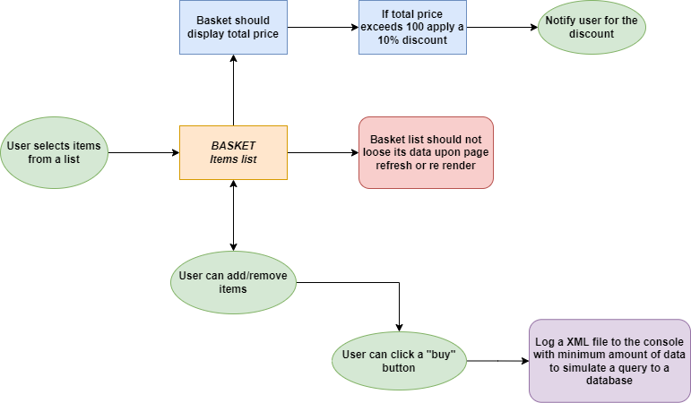

# Exercise submission for an E-Commerce web application

This exercise project was made with [Create React App](https://github.com/facebook/create-react-app).

### Links

- Live Site URL: https://monumental-choux-a35f9b.netlify.app

### A Flowchart was designed and followed based on given tasks to make the coding process easier.

<!-- ## Exercise instructions had the following tasks

1. Please create a simple single page browser application where the user can add/remove items into their basket from a pool of priced items (dummy, hard-coded within the App).

2. Basket should display total price and allow for quantity changes.

3. When total exceeds €100 then apply 10% discount and notify user.

4. A "buy" button should log (in console) an XML with the minimum amount of data required to describe the state of the basket (assume that this is to be sent to the back-end managing the items).

5. Basket should survive browser refreshes. -->
